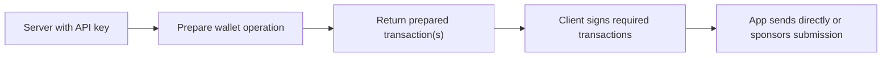

The Developer SDK is deliberately split across server and client roles.

## The core flow



## What stays on the server

The server owns:

- the Swig API key
- wallet preparation calls
- optional sponsor submission
- any app-specific auth, request validation, and policy checks

The main entrypoint is:

```typescript
import { SwigClient } from '@swig-wallet/developer-sdk/server/typescript';
```

## What reaches the client

The client should only receive prepared transaction payloads and their
signature metadata. It should not receive the API key or call the Swig backend
directly.

## Why the response is split

Prepared responses are categorized so your app knows what to do next:

| Field | What your app should do |
|-------|-------------------------|
| `transactions` | submit these in order |
| `clientAuthorityTransactions` | get a client authority signature first |
| `feePayerOnlyTransactions` | send or sponsor without client authority signing |
| `operatorSignedTransactions` | submit as-is after fee payer or sponsor handling |

For recovery-enabled wallet creation, `create(...)` also returns
`creationTransaction`, `addAuthorityTransaction`, `configureRecoveryTransaction`,
and sometimes `recoverySetup`.

## Wallet handles

The server-side wallet handle is how you move from "I know this wallet" to "I
want to prepare actions for it":

```typescript
const wallet = swig.wallets.use({
  swigConfigAddress,
  walletAddress,
  requesterAuthority: {
    ed25519: {
      publicKey: userPublicKey,
    },
  },
});
```

If you already have an IDP session, the SDK also supports
`swig.wallets.fromIdpSession(session)`.

## The client helpers

The client package is intentionally small:

- `signPreparedTransaction(...)` for normal Ed25519 transaction signing
- `signPreparedSwigTransaction(...)` and
  `signPreparedSwigTransactions(...)` for passkey-backed Swig signature flows
- passkey signing helpers such as `createSecp256r1PasskeySigningFn(...)`

Use the browser and framework pages next if you want this split without writing
all of the proxy glue yourself.
