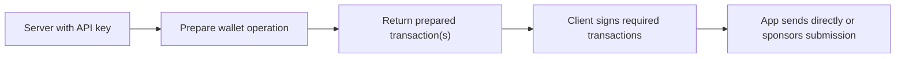

The Developer SDK is deliberately split across server and client roles.

## The core flow



## What stays on the server

The server owns:

- the Swig API key
- wallet preparation calls and wallet reads
- optional sponsor submission
- any app-specific auth, request validation, and policy checks

<Warning>
  API keys are server-only credentials. Never ship one to a browser or mobile
  bundle, and never expose one through a public build-time variable such as
  `NEXT_PUBLIC_*`. Browser code should reach Swig only through a route in your
  own app.
</Warning>

The main entrypoint is:

<CodeGroup dropdown>

```typescript TypeScript
import { SwigClient } from '@swig-wallet/developer-sdk/server/typescript';

const swig = new SwigClient({
  apiKey: process.env.SWIG_API_KEY!,
  network: 'devnet',
});
```

```python Python
from swig_developer_sdk import SwigClient

swig = SwigClient(api_key=os.environ["SWIG_API_KEY"], network="devnet")
```

</CodeGroup>

Requests authenticate with `Authorization: Bearer <api-key>` against
`https://api.onswig.com`. Set `baseUrl` / `base_url` to target a different
deployment.

## Retries and safe repeats

The SDKs treat reads and writes differently on purpose:

| Request | Retry behavior |
| :--- | :--- |
| `GET` | retried under the configured retry policy |
| `POST` | not retried by default — a replay could duplicate work |
| Sponsorship `POST` | retried only when you pass an idempotency key |

That means wallet reads are safe to repeat, and preparation calls fail fast so
your app decides whether repeating is correct. When your app may retry
sponsorship, pass `idempotencyKey` / `idempotency_key`; a matching retry
returns the original paymaster response instead of spending twice.

`4xx` responses raise immediately. `5xx` and network failures are what the
retry policy covers.

## What reaches the client

The client should only receive prepared transaction payloads and their
signature metadata. It should not receive the API key or call the Swig API
directly.

## Why the response is split

Prepared responses are categorized so your app knows what to do next:

| TypeScript / Python | What your app should do |
| :--- | :--- |
| `transactions` | submit these in order |
| `clientAuthorityTransactions` / `client_authority_transactions` | get a client authority signature first |
| `feePayerOnlyTransactions` / `fee_payer_only_transactions` | send or sponsor without client authority signing |

A prepared transaction needs a client authority signature exactly when its
`signatureRequests` / `signature_requests` collection is non-empty.

## Wallet handles

The server-side wallet handle is how you move from "I know this wallet" to "I
want to prepare actions for it":

<CodeGroup dropdown>

```typescript TypeScript
const wallet = swig.wallets.use({
  swigConfigAddress,
  walletAddress,
  requesterAuthority: {
    ed25519: {
      publicKey: userPublicKey,
    },
  },
});
```

```python Python
wallet = swig.wallets.use(
    swig_config_address,
    requester_authority={
        "ed25519": {
            "publicKey": user_public_key,
        },
    },
)
```

</CodeGroup>

If you already have an IdP session, the SDK also supports
`swig.wallets.fromIdpSession(session)` /
`swig.wallets.from_idp_session(session)`.

Direct server-side preparation requires that session to contain
`requesterAuthority` / `requester_authority`, or that you pass a freshly
resolved authority override. The session's `roleId` and
`authorityPublicKey` metadata are not converted into an authority
automatically. Wallet reads do not need this authority.

The same handle serves preparation and reads. Reads do not need a requester
authority.

## The client helpers

The client package is intentionally small:

- `signPreparedTransaction(...)` / `sign_prepared_transaction(...)` for normal
  Ed25519 transaction signing
- `signPreparedSwigTransaction(...)` / `sign_prepared_swig_transaction(...)`
  for passkey and EVM Swig signature flows
- signer factories such as `createSecp256r1PasskeySigningFn(...)` /
  `create_secp256r1_passkey_signing_fn(...)` and
  `createSecp256k1EvmSigningFn(...)` /
  `create_secp256k1_evm_signing_fn(...)`

Use the [proxy helpers](/developer-sdk/framework-proxies) next if you want this
split without writing all of the route glue yourself.
