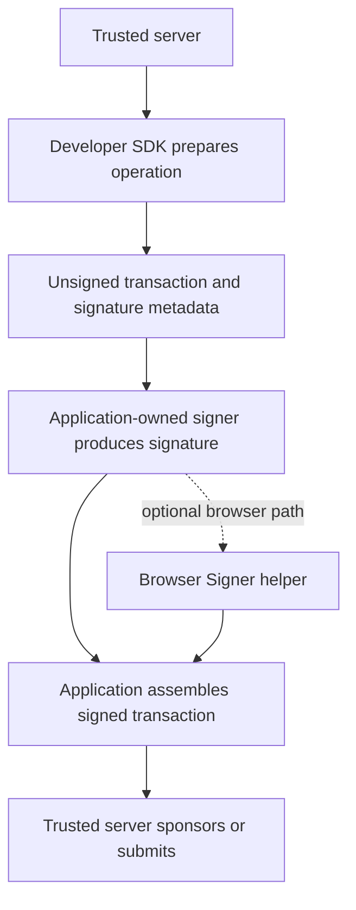

The Developer SDK's API client has one trust boundary: it runs on your server
with a Swig developer API key. The package's narrow signing helpers are
separate and cannot call the hosted API.

## Transaction lifecycle



The signer may be a wallet, passkey flow, hardware device, HSM, enclave, or
custody service. Your application owns that integration and the key material.
The optional helper only adapts its result to the prepared transaction format.

## Credentials and imports

<CodeGroup dropdown>

```typescript TypeScript
import { SwigClient } from '@swig-wallet/developer-sdk';

const swig = new SwigClient({
  apiKey: process.env.SWIG_API_KEY!,
  network: 'devnet',
});
```

```python Python
import os

from swig_developer_sdk import SwigClient

swig = SwigClient(
    api_key=os.environ["SWIG_API_KEY"],
    network="devnet",
)
```

</CodeGroup>

Requests use `Authorization: Bearer <api-key>` against
`https://api.onswig.com`. Set `baseUrl` / `base_url` only when targeting a
different trusted deployment.

<Warning>
  Do not use `NEXT_PUBLIC_*`, Vite public variables, or mobile build variables
  for the API key. Do not import `SwigClient` or any server entrypoint into
  shipped client code.
</Warning>

## Prepared response groups

Prepared responses preserve transaction order and expose embedded signature
metadata. Treat the serialized Solana transaction as the final source of truth
for transaction-level signers:

| TypeScript / Python | Meaning |
| :--- | :--- |
| `transactions` | full ordered list to coordinate and submit |
| `clientAuthorityTransactions` / `client_authority_transactions` | transactions with explicit embedded `secp256r1` or `secp256k1` signature requests |
| `feePayerOnlyTransactions` / `fee_payer_only_transactions` | transactions without explicit signature requests; inspect the Solana required signer set before treating them as fee-payer-only |
| `signatureRequests` / `signature_requests` | embedded signature scheme, signer, message hash, slot, and counter metadata |

The word `client` in the response schema identifies an API category. It does
not describe a shipped browser client, and the derived collections are not a
complete transaction-signature checklist. In particular, an Ed25519 requester
is represented as a required signer in the serialized Solana transaction while
`signatureRequests` remains empty.

## Retries and safe repeats

| Request | Retry behavior |
| :--- | :--- |
| `GET` | retried under the configured retry policy |
| `POST` | not retried by default because replay could duplicate work |
| Sponsorship `POST` | retried only with an idempotency key |

`4xx` responses raise immediately. Network failures and `5xx` responses use
the configured retry policy where the operation is safe to repeat.

## Wallet handles

A server-side wallet handle binds the config address, optional wallet address,
network, and requester authority used for preparation:

<CodeGroup dropdown>

```typescript TypeScript
const wallet = swig.wallets.use({
  swigConfigAddress,
  walletAddress,
  requesterAuthority: {
    ed25519: { publicKey: authorityPublicKey },
  },
});
```

```python Python
from swig_developer_sdk import WalletReference

wallet = swig.wallets.use(
    WalletReference(
        swig_config_address=swig_config_address,
        wallet_address=wallet_address,
        requester_authority={
            "ed25519": {"publicKey": authority_public_key},
        },
    )
)
```

</CodeGroup>

Reads do not require a requester authority. Preparation calls do. If the
authority comes from application auth or role mapping, resolve and validate it
on the server before calling the SDK.

Continue to [Browser Signers](/developer-sdk/browser-signing) for the optional
no-API-key helper surface.
