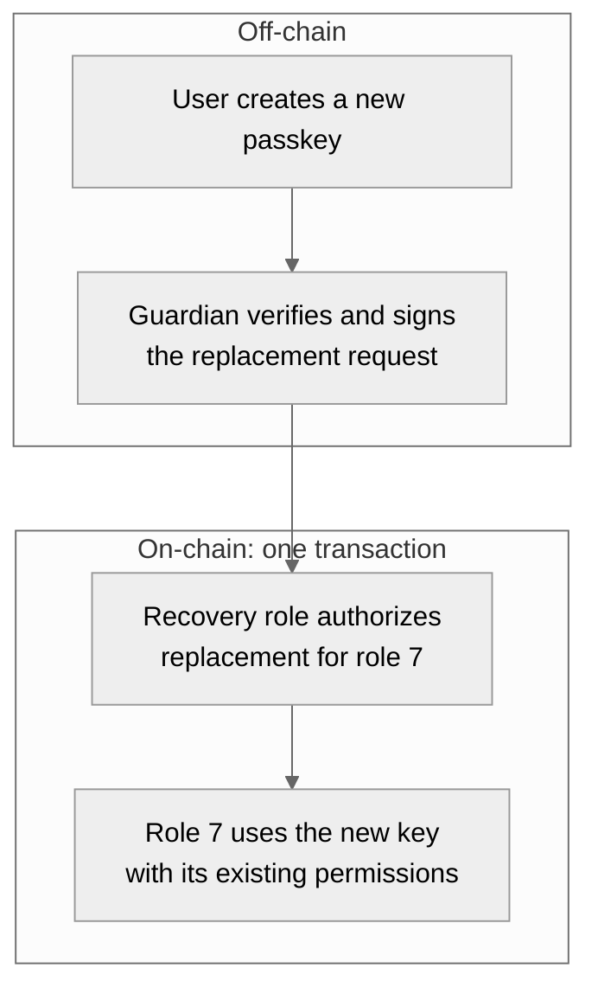
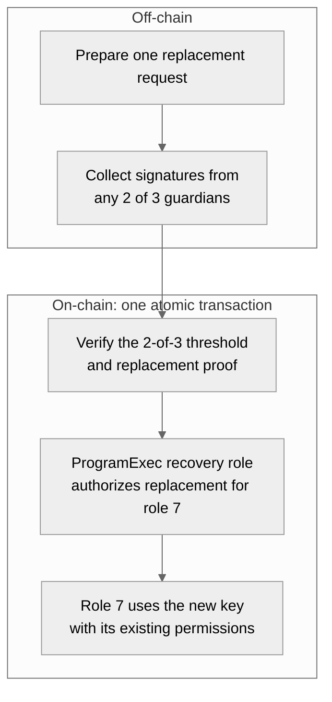

Guardian recovery delegates the ability to replace a lost signer's key while
preserving the wallet and the target role's permissions. Configure this
delegation while an existing authorized signer is still available. A new
passkey alone cannot recover a wallet that has no surviving authorization path.

The current protocol permission for this purpose is
`ReplaceAuthority { role_id }`, used with `ReplaceAuthorityV1`. Older recovery
documentation calls the permission `RecoveryAuthority` and the instruction
`RecoverAuthorityV1`. `ReplaceAuthority` explicitly scopes the delegation to
one target role and preserves that role's ID, authority type, and actions.
For a passkey role, this means replacing its P-256 public key with another
P-256 public key. See the
[protocol permission definition](https://github.com/anagrambuild/swig-wallet/blob/3e0411f0c2980b26296903eaa4aa0c2d07869316/state/src/action/replace_authority.rs).

**Integration status:** The following cases describe the recommended protocol
design. The Developer SDK (TypeScript `0.10.0` and Python `0.9.0`) does not yet expose this scoped
permission or a replacement preparation flow. Recovery API types retained
for compatibility do not provide a working recovery flow in these versions.
Use a protocol integration with a compatible deployed program for the base
case; the multiple-approval case requires the additional integration described
below. These examples do not establish deployment or audit coverage.

## Elect and authorize a guardian

Electing a guardian means choosing who may authorize a future key replacement,
then recording that delegation on-chain while an existing wallet administrator
is still available.

1. **Choose the role to protect.** In this example, the user's passkey controls
   role `7`. Recovery replaces that role's key and preserves its permissions.
2. **Choose a guardian and verify its public key.** The guardian can be a
   backup device, a trusted person, or a service with a signing authority. Its
   key should remain available independently of the passkey being protected.
3. **Grant scoped replacement authority.** An existing authority with `all` or
   `manageAuthority` adds a separate role for the guardian. Give that role only
   the protocol permission `ReplaceAuthority { role_id: 7 }`, using a compatible
   protocol integration. The Developer SDK's `roles.add()` action list does
   not yet expose this permission.
4. **Confirm the delegation.** After the setup transaction confirms, inspect
   the recovery role's authority, target role ID, and permissions. Choosing a
   guardian in your application or saving it in a policy template alone does
   not establish this on-chain authorization.

The guardian uses its own authority to approve recovery. It does not need the
lost passkey or `manageAuthority` for the replacement itself. The administrator's
broader permission is needed to configure the separate recovery role.

## Recover with one guardian

Once the guardian's recovery role is configured, the guardian can authorize
replacement even when the user's original passkey is unavailable.

1. The user creates a new passkey and obtains its public key.
2. The guardian verifies the recovery request and approves that specific new
   key for role `7` in this wallet.
3. The guardian authenticates a `ReplaceAuthorityV1` transaction through the
   recovery role. The lost passkey does not need to sign.
4. After confirmation, role `7` keeps its permissions and uses the new passkey.
   If the target is a session authority, replacement clears its existing
   session key and expiration.

The recovery role cannot use that scoped permission to add arbitrary roles,
change role `7`'s actions, or replace another role's signer. It does not need
`manageAuthority`. However, the guardian can appoint the key that inherits
role `7`'s existing power, so protecting the guardian is part of protecting
that role. A waiting period or cancellation mechanism would be a separate
recovery policy; the scoped replacement permission does not add either.

## Require multiple approvals with a Participant Set

A Participant Set can extend the design from one guardian to a threshold of
guardians. For example, elect three guardians and require any two to approve
the same replacement. This composition requires the integration described below.

In this proposed integration:

1. Create a ParticipantSet for the wallet with the three guardian authorities
   as members and threshold `2`.
2. Use a `ProgramExec` authority controlled by the multi-authority program and
   that set for the **one recovery role**.
3. Keep `ReplaceAuthority { role_id: 7 }` as that role's only permission.

The threshold changes who must approve; the scope stays limited to replacing
the key of role `7`.

The diagram shows the proposed extension; it requires the integration work
described below.

The ParticipantSet controls **who must approve**, while the scoped permission
controls **which role they may recover**. Give the permission to the one
threshold-controlled role. Giving each guardian its own recovery role would
allow each guardian to replace the key independently.

The intended flow is to prepare one replacement, collect enough guardian
signatures off-chain, and submit one transaction that verifies the threshold
and replaces the key atomically. Each guardian's approval must bind the same
wallet, target role, and exact key replacement. The original passkey is not
one of the required approvals unless the application deliberately includes it
in the policy.

### Collect signatures off-chain

This is **synchronous on-chain approval**: all required proofs are supplied
when the replacement executes. Guardians can sign at different moments
off-chain, but the approvals must remain valid for the same prepared operation,
nonce, and expiration. The application distributes approval requests and
collects signatures; separate on-chain approvals do not accumulate into a
durable recovery proposal.

The Developer SDK already provides the general collection and compilation
workflow through `participantSetApprovalPlan`, `signParticipantSetApproval`,
and `compileParticipantSetApprovals`, with corresponding Python helpers.
See [Participant Sets](/developer-sdk/participant-sets) for working examples
on supported operations.

### Connect threshold approval to key replacement

ParticipantSet recovery preparation is not currently supported. A recovery
integration must connect the multi-authority program's
threshold approval to the replacement-specific proof expected by
`ReplaceAuthorityV1`, and expose preparation and compilation for that
operation. Ordinary ParticipantSet authorization alone is not that proof.
Confirm the complete flow against the deployed protocol and its audit scope
before offering this extension to users.
