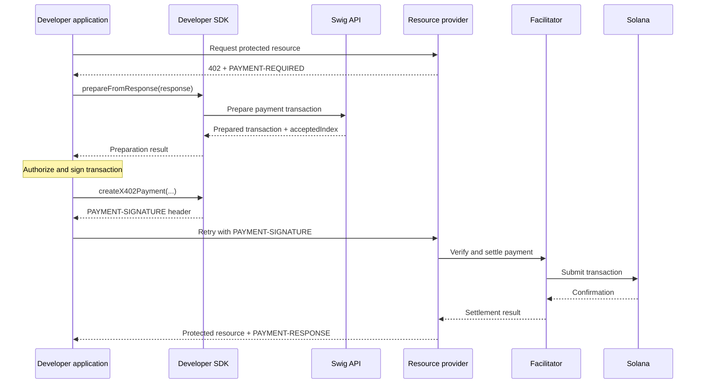

Use a Swig wallet to pay for APIs and other HTTP resources that return
`402 Payment Required`. Pass the response to the Developer SDK to prepare a
payment transaction. Your application authorizes and signs the payment, then
sends the original request again with a `PAYMENT-SIGNATURE` header. The resource
provider's facilitator verifies and settles the payment.

## How the payment flow works



The Swig API prepares the payment transaction but does not submit or settle it.

## Before you begin

You need:

- a configured `SwigClient` and an existing Swig wallet
- an Ed25519 or secp256r1 authority assigned to a role permitted to invoke the
  token program and spend the selected mint
- an x402 version 2 resource offering the `exact` payment scheme on the wallet's
  Solana mainnet or devnet network
- the wallet's canonical associated token account, already created and funded
  with enough of the requested token
- the recipient's canonical associated token account, already created for the
  `payTo` owner and mint
- a legacy SPL Token mint or a Token-2022 mint with no extensions; Token-2022
  token accounts may have no extensions or only `ImmutableOwner`
- a facilitator that supports Swig smart-wallet verification

Other Token-2022 mint and token-account extensions are not supported.

For passkey payments, the facilitator must also permit Solana's secp256r1
signature-verification program.

## Pay for a resource

These examples use an Ed25519 requester and assume your application provides
the Swig wallet identifiers, requester public key, resource URL, and signing
callback.

`signTransaction` / `sign_transaction` receives the base64 serialized
transaction and prepared record, then returns the signed base64 transaction.
See [Signers](/developer-sdk/signers) for Ed25519 and passkey signing patterns.

The examples request a resource with `GET` and no additional headers. In your
integration, repeat the original request with the same URL, method, body, and
existing headers, adding the generated `PAYMENT-SIGNATURE` header.

<CodeGroup dropdown>

```typescript TypeScript
import {
  SwigClient,
  createX402Payment,
} from '@swig-wallet/developer-sdk';
import { signPreparedTransaction } from '@swig-wallet/developer-sdk/signers';

const swig = new SwigClient({
  apiKey: process.env.SWIG_API_KEY!,
  network: 'devnet',
});

const wallet = swig.wallets.use({
  swigConfigAddress,
  walletAddress,
  requesterAuthority: {
    ed25519: { publicKey: developerPublicKey },
  },
});

const challenge = await fetch(resourceUrl);
const prepared = await wallet.x402.prepareFromResponse(challenge);

const signed = await signPreparedTransaction(
  prepared.preparedTransaction,
  { signTransaction },
);

const payment = createX402Payment(prepared, signed);

const paidResponse = await fetch(resourceUrl, {
  headers: payment.paymentSignatureHeaders,
});

if (!paidResponse.ok) {
  throw new Error(`Paid request failed: ${paidResponse.status}`);
}

const resource = await paidResponse.json();
const paymentResponse = paidResponse.headers.get('PAYMENT-RESPONSE');
```

```python Python
import asyncio
import os

import httpx

from swig_developer_sdk import SwigClient, create_x402_payment
from swig_developer_sdk.signers import sign_prepared_transaction

swig = SwigClient(
    api_key=os.environ["SWIG_API_KEY"],
    network="devnet",
)

wallet = swig.wallets.use(
    swig_config_address,
    requester_authority={
        "ed25519": {"publicKey": developer_public_key},
    },
)

async def main() -> None:
    async with httpx.AsyncClient() as http:
        challenge = await http.get(resource_url)
        prepared = await wallet.x402.prepare_from_response(challenge)

        signed = await sign_prepared_transaction(
            prepared.prepared_transaction,
            sign_transaction=sign_transaction,
        )

        payment = create_x402_payment(prepared, signed)

        paid_response = await http.get(
            resource_url,
            headers=payment.payment_signature_headers,
        )
        paid_response.raise_for_status()

        resource = paid_response.json()
        payment_response = paid_response.headers.get("PAYMENT-RESPONSE")


if __name__ == "__main__":
    asyncio.run(main())
```

</CodeGroup>

## Understand the prepared result

`prepareFromResponse()` / `prepare_from_response()` returns:

| Field | Description |
| :--- | :--- |
| `preparedTransaction` / `prepared_transaction` | The unsigned Swig payment transaction and any embedded signature requests |
| `paymentRequired` / `payment_required` | The validated x402 payment challenge used during preparation |
| `acceptedIndex` / `accepted_index` | The selected offer's position in the original `accepts` array |

After signing, `createX402Payment()` / `create_x402_payment()` returns:

| Field | Description |
| :--- | :--- |
| `paymentPayload` / `payment_payload` | The x402 payment payload containing the selected offer and signed transaction |
| `paymentSignatureHeaders` / `payment_signature_headers` | A `PAYMENT-SIGNATURE` header ready to merge into the resource retry |

## Choose a payment offer

Each entry in the challenge's `accepts` array is a payment offer. When the index
is omitted, Swig selects the first supported offer using the `exact` scheme on
the wallet's Solana network. The result preserves that offer's position in the
original `accepts` array.

Pass an index when your application has already chosen an offer:

<CodeGroup dropdown>

```typescript TypeScript
const prepared = await wallet.x402.prepareFromResponse(challenge, {
  acceptedIndex: 2,
});
```

```python Python
prepared = await wallet.x402.prepare_from_response(
    challenge,
    accepted_index=2,
)
```

</CodeGroup>

An explicit index must identify a supported `exact` offer on the wallet's
Solana network. Swig returns an error instead of falling back to another offer
when the selected offer is incompatible.

## Run the complete example

<Card
  title="x402 Payment Example"
  icon="code"
  href="https://github.com/anagrambuild/swig-developer-sdk/tree/main/typescript/examples/x402"
>
  Run a resource provider, facilitator, and Swig payer through the complete
  challenge, preparation, signing, settlement, and paid-resource flow.
</Card>

## What to read next

<CardGroup cols={2}>
  <Card title="Signers" icon="signature" href="/developer-sdk/signers">
    Connect application-owned Ed25519 keys or passkeys.
  </Card>
  <Card title="Add Roles and Permissions" icon="user-shield" href="/developer-sdk/add-roles-and-permissions">
    Assign a requester authority to an existing Swig wallet.
  </Card>
  <Card title="Transfer SOL and Tokens" icon="arrow-right-arrow-left" href="/developer-sdk/transfers-and-swaps">
    Prepare ordinary wallet transfers outside the x402 flow.
  </Card>
  <Card title="Transaction API" icon="code" href="/developer-api/transactions">
    Integrate with Swig's transaction endpoints directly.
  </Card>
</CardGroup>
